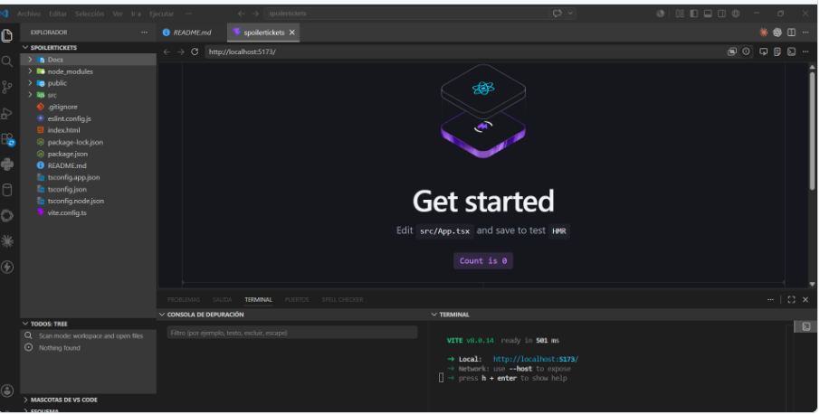
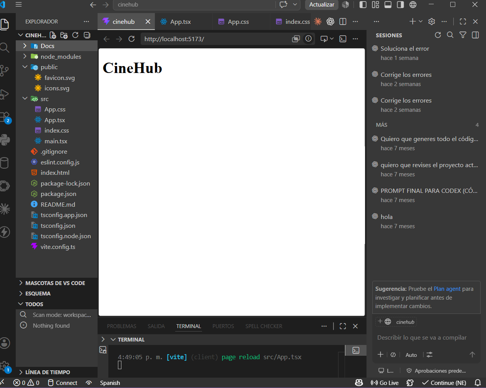
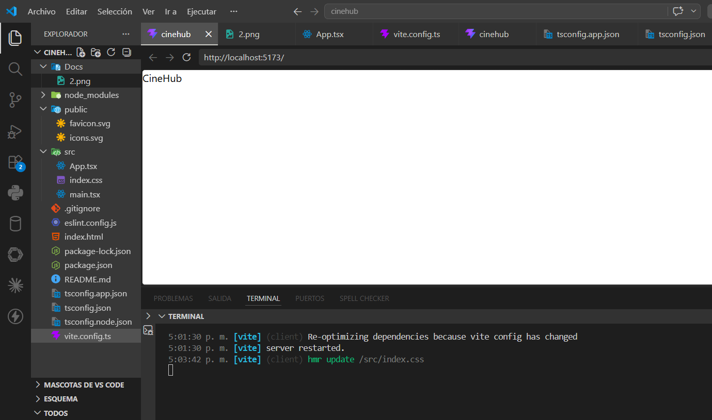
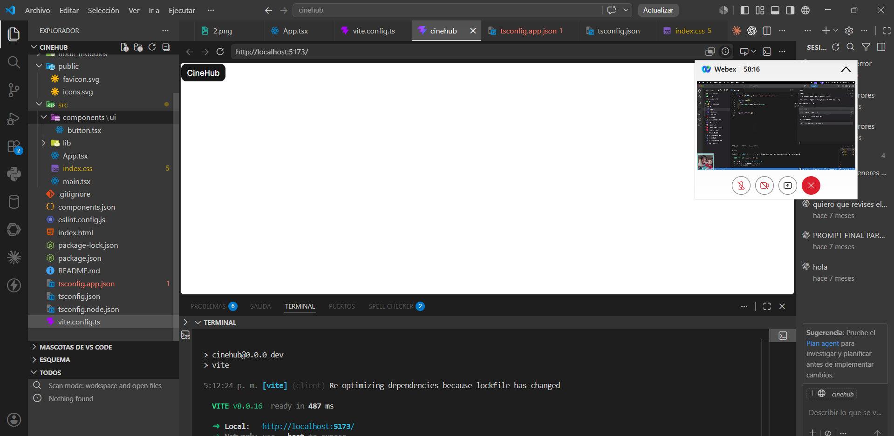
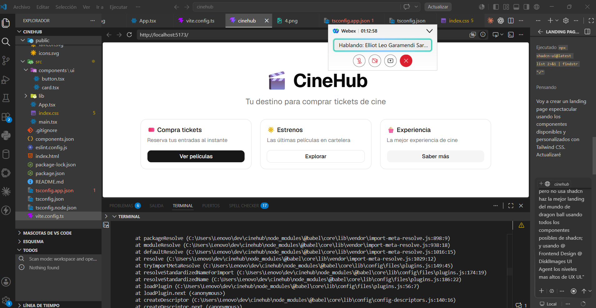
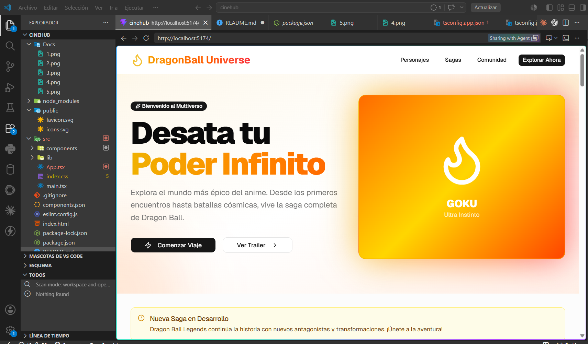
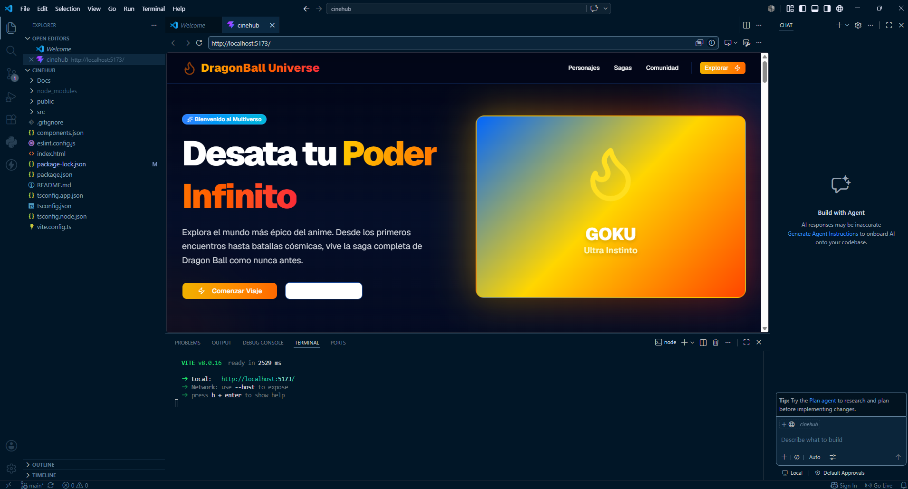
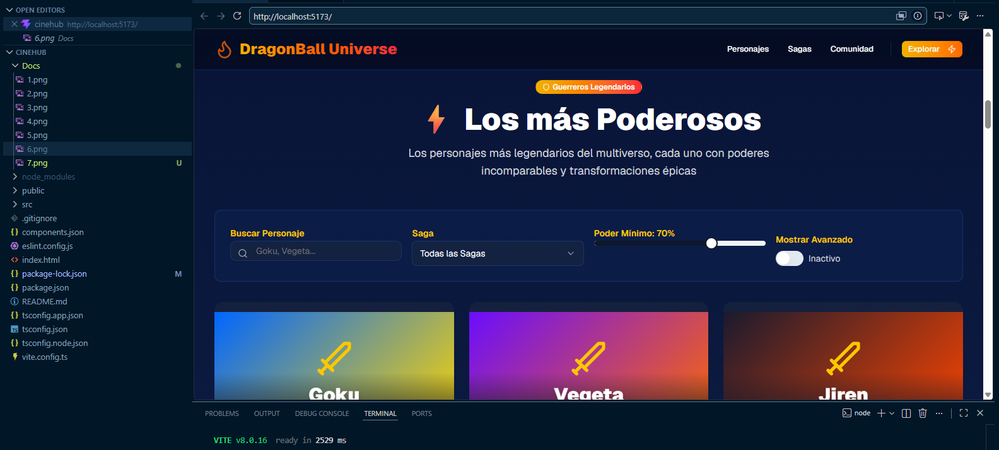

# 🎬 CineHub

E-commerce de tickets de cine construido con React, TypeScript y las mejores librerías modernas del ecosistema.

## 🚀 Tecnologías

- ⚛️ React 19 + Vite
- 🟦 TypeScript
- 🌑 Tailwind CSS v4
- 🧩 shadcn/ui (Radix UI)
- 🔄 TanStack Query
- 🌐 Axios
- 🗺️ React Router DOM
- 🐻 Zustand
- 🎬 TMDB API

## 📸 Capturas de Pantalla

### Anali Salvador Advincula







### Ederd Carrasco Oscco



## 📦 Instalación

```bash
git clone https://github.com/anali-salvador/cinehub.git
cd cinehub
npm install
npm run dev
```

## ⚙️ Variables de Entorno

Crea un archivo `.env` en la raíz:

```env
VITE_TMDB_API_KEY=tu_api_key_aqui
```

## ✨ Funcionalidades

- 🎟️ Listado de películas en cartelera
- 🔍 Detalle de película
- 🛒 Carrito de tickets
- 🌑 UI oscura y minimalista

## 👥 Autores

**Anali Salvador Advincula** — [@anali-salvador](https://github.com/anali-salvador)  
**Ederd Carrasco Oscco** — [@eder3105](https://github.com/eder3105)

---
Proyecto desarrollado en TECSUP 2026